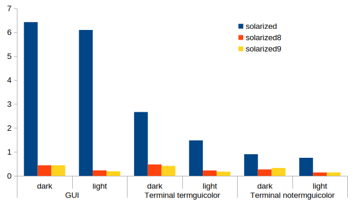

# Solarized9

## Introduction

* Solarized base
* Do not use italic when using wide character.
* Use bold for emphasis only.
* Use invert 'set background=light/dark' background color to make the default (Normal) text color.
* In terminal
  ```vim
  highlight Normal ctermbg=NONE guibg=NONE
  ```
  to support transparency.
  * To disable transparency:
    ```vim
    let g:solarized9_set = #{transparent: v:false}
    ```
  * If you want to use transparency, you have to set solarized theme in terminal.

## Setting order

1. Normal
2. |highligh-default| OR |group-name| (not a link)
3. other (not a link)
4. |highligh-default| OR |group-name| (link)
5. other (link)

* 1-3: Order is dark-&gt;light-&gt;common.
* 1-3: Sort alphabetically for each category: dark, light and common.
  * Prioritize |highlight-default| and 'suggested group names'.
* 4-5: Sort by link destination.
  * Prioritize |highlight-default| and 'suggested group names'.

## Speed

result after running 100 times

|                |background| solarized | solarized8 | solarized9 |
|----------------|:--------:|:---------:|:----------:|:----------:|
| GUI            | dark     | 6.422965  | 0.442200   | 0.442785   |
|                | light    | 6.094189  | 0.229087   | 0.193094   |
| Terminal       | dark     | 2.667654  | 0.476513   | 0.418074   |
| termguicolor   | light    | 1.480818  | 0.225828   | 0.177489   |
| Terminal       | dark     | 0.904130  | 0.270351   | 0.331041   |
| notermguicolor | light    | 0.755304  | 0.142734   | 0.142416   |


